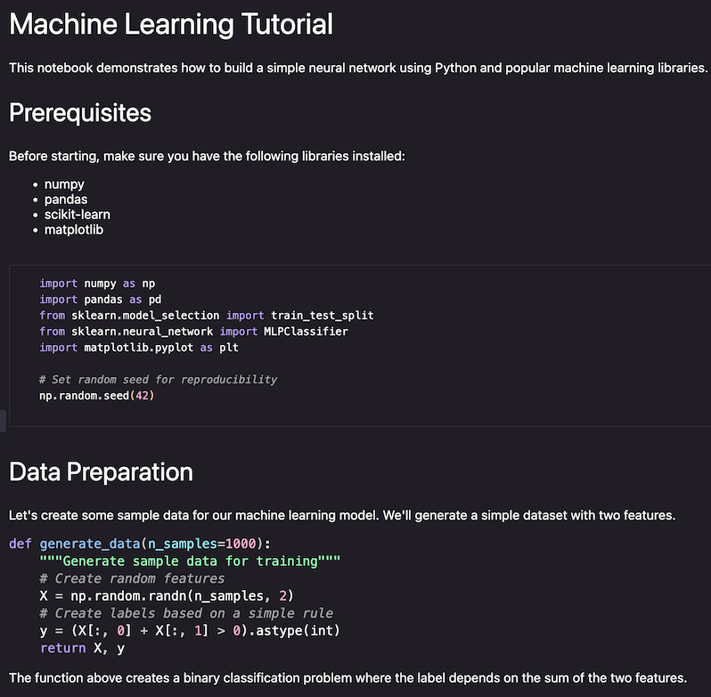
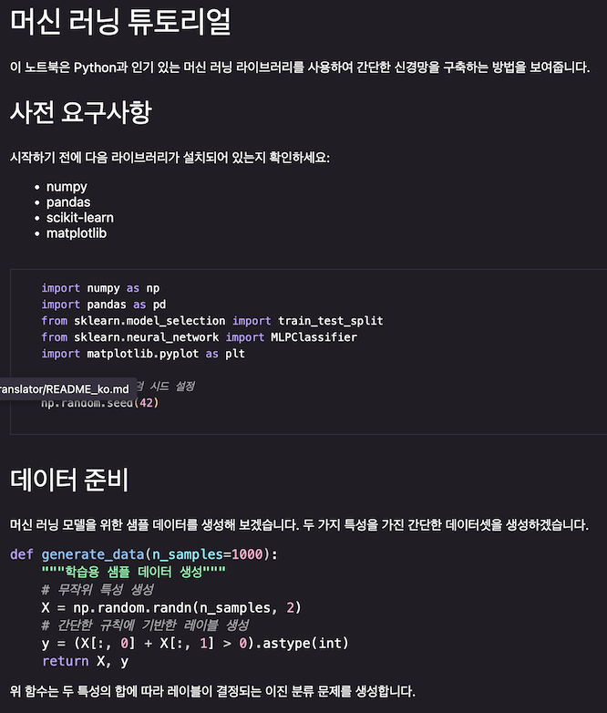
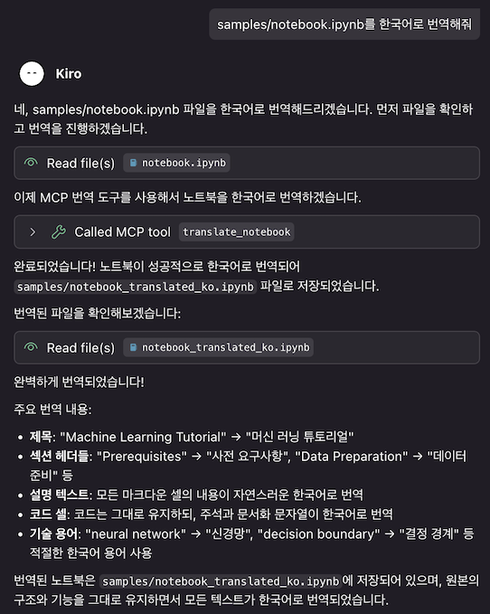

# Jupyter Notebook Translator

A Jupyter Notebook translation tool that provides high-quality translations using AWS Bedrock. Depending on configuration, it can translate only markdown cell text or translate both markdown cell text and code cell text/comments.

## Key Features

- 🔄 **Markdown Cell Translation**: Translate only markdown cells while preserving code cells
- 💬 **Comment Translation**: Translate # comments in code blocks within markdown
- 🚀 **Batch Processing**: Translate multiple cells at once for improved efficiency
- 🎨 **Natural Translation**: Natural translation option instead of literal translation
- 🌐 **Multi-language Support**: Support for 50+ languages
- 🤖 **Multiple Models**: Support for various LLM models from AWS Bedrock

## Examples

### Translation

<table>
<tr>
<td></td>
<td></td>
</tr>
<tr>
<td align="center"><em>Original (English)</em></td>
<td align="center"><em>Translated to Korean</em></td>
</tr>
</table>

### Kiro MCP Examples



## Installation

```bash
# Clone repository
git clone https://github.com/daekeun-ml/ipynb-translator.git
cd ipynb-translator

# If uv is not installed
curl -LsSf https://astral.sh/uv/install.sh | sh

# Dependencies are automatically managed by uv
```

## Configuration

1. Set up AWS credentials:
```bash
aws configure
```

2. Set environment variables (optional):
```bash
cp .env.example .env
# Edit .env file to adjust settings
```

## Usage

### Basic Translation

```bash
# Translate to Korean
uv run ipynb-translate translate notebook.ipynb

# Translate to specific language
uv run ipynb-translate translate notebook.ipynb -l ja

# Specify output file
uv run ipynb-translate translate notebook.ipynb -o translated_notebook.ipynb
```

### Download from URL and Translate

```bash
# Download notebook from GitHub URL and translate to Korean
uv run ipynb-translate translate-url https://github.com/awslabs/amazon-bedrock-agentcore-samples/blob/main/01-tutorials/01-AgentCore-runtime/02-hosting-MCP-server/hosting_mcp_server.ipynb

# Translate to specific language and keep original file
uv run ipynb-translate translate-url https://example.com/notebook.ipynb -l ja --keep-original

# Specify output file
uv run ipynb-translate translate-url https://example.com/notebook.ipynb -o my_translated_notebook.ipynb
```

### Translate Directory Path

```bash
# Translate all notebooks in a directory
uv run ipynb-translate translate-folder ./notebooks

# Translate with specific language
uv run ipynb-translate translate-folder ./notebooks -l ja
```

### Advanced Options

```bash
# Use specific model
uv run ipynb-translate translate samples/notebook.ipynb -m cohere.command-r-plus-v1:0

# Adjust batch size
uv run ipynb-translate translate notebook.ipynb -b 10

# Translation preview
uv run ipynb-translate translate notebook.ipynb --preview
```

### Utility Commands

```bash
# Check notebook information
uv run ipynb-translate info notebook.ipynb

# List supported languages
uv run ipynb-translate list-languages

# List supported models
uv run ipynb-translate list-models

# Check AWS credentials
uv run ipynb-translate check-credentials
```

## Translation Example

### Original Markdown Cell
```markdown
# Machine Learning Tutorial

This notebook demonstrates how to build a simple neural network.

```python
def train_model(data):
    """Train a machine learning model"""
    # Initialize the model
    model = create_model()
    return model
```

Let's start with data preprocessing.
```

### Translated Markdown Cell (Korean)
```markdown
# 머신 러닝 튜토리얼

이 노트북은 간단한 신경망을 구축하는 방법을 보여줍니다.

```python
def train_model(data):
    """Train a machine learning model"""
    # 모델을 초기화합니다
    model = create_model()
    return model
```

데이터 전처리부터 시작해보겠습니다.
```

## Supported Languages

Major supported languages:
- Korean (ko)
- Japanese (ja)
- Chinese Simplified (zh-CN)
- Chinese Traditional (zh-TW)
- English (en)
- French (fr)
- German (de)
- Spanish (es)
- Italian (it)
- Portuguese (pt)
- Russian (ru)
- Arabic (ar)
- Hindi (hi)
- Thai (th)
- Vietnamese (vi)

Full list: `uv run ipynb-translate list-languages`

## Supported Models

- Amazon Nova (nova-micro, nova-lite, nova-pro, nova-premier)
- Anthropic Claude (3.5 Sonnet, 3.5 Haiku, 3.7 Sonnet, 4 Sonnet, 4 Opus)
- Meta Llama 3 (8B, 70B) / Llama 3.1 (8B, 70B, 405B) / Llama 3.2 (1B, 3B, 11B, 90B) / Llama 3.3 (70B)
- Meta Llama 4 (Scout 17B, Maverick 17B)
- DeepSeek R1
- Mistral (7B, 8x7B, Large)
- Cohere Command R/R+

Full list: `uv run ipynb-translate list-models`

## Configuration Options

You can adjust the following settings in the `.env` file:

```bash
# AWS Configuration
AWS_REGION=us-east-1
AWS_PROFILE=default

# Translation Configuration
DEFAULT_TARGET_LANGUAGE=ko
BEDROCK_MODEL_ID=us.anthropic.claude-3-7-sonnet-20250219-v1:0
MAX_TOKENS=2000
TEMPERATURE=0.1
ENABLE_POLISHING=true          # Enable natural translation
TRANSLATE_CODE_CELLS=false     # Disable code cell comment translation
BATCH_SIZE=5

# Debug Settings
DEBUG=false
```

## MCP Server Usage

FastMCP-based MCP server provides Jupyter Notebook translation functionality.

### MCP Server Execution

```bash
# Run MCP server
uv run python mcp_server.py
```

### MCP Tools

#### 1. translate_notebook
Translate Jupyter notebook to specified language.

**Parameters:**
- `notebook_path` (required): Notebook file path
- `target_language` (default: "ko"): Target language code
- `output_path` (optional): Output file path
- `model_id` (optional): Bedrock model ID
- `batch_size` (default: 20): Batch size
- `translate_code_cells` (default: false): Whether to translate code cell comments
- `enable_polishing` (default: true): Enable natural translation

#### 2. translate_from_url
Download notebook from URL and translate.

**Parameters:**
- `url` (required): Notebook URL
- `target_language` (default: "ko"): Target language code
- `output_path` (optional): Output file path
- `keep_original` (default: false): Keep original file
- `translate_code_cells` (default: false): Whether to translate code cell comments
- `enable_polishing` (default: true): Enable natural translation

#### 3. get_notebook_info
Get notebook file information.

#### 4. list_supported_languages
Return list of supported languages.

### MCP Client Configuration

Add to configuration file for Claude Desktop or other MCP clients:

```json
{
  "mcpServers": {
    "ipynb-translator": {
      "command": "uv",
      "args": ["run", "python", "mcp_server.py"],
      "cwd": "/path/to/ipynb-translator",
      "env": {
        "PYTHONPATH": "/path/to/ipynb-translator",
        "AWS_REGION": "us-east-1",
        "DEFAULT_TARGET_LANGUAGE": "ko",
        "BEDROCK_MODEL_ID": "us.anthropic.claude-3-7-sonnet-20250219-v1:0",
        "BATCH_SIZE": "5",
        "ENABLE_POLISHING": "true",
        "TRANSLATE_CODE_CELLS": "false",
        "TEMPERATURE": "0.1",
        "MAX_TOKENS": "2000"
      }
    }
  }
}
```

### MCP Environment Variables

You can set the following environment variables in the `env` section of `mcp_config.json`:

- `AWS_REGION`: AWS region (default: us-east-1)
- `AWS_PROFILE`: AWS profile name (optional)
- `DEFAULT_TARGET_LANGUAGE`: Default translation language (default: ko)
- `BEDROCK_MODEL_ID`: Bedrock model ID to use
- `BATCH_SIZE`: Batch processing size (default: 5)
- `ENABLE_POLISHING`: Enable natural translation (true/false)
- `TRANSLATE_CODE_CELLS`: Translate code cell comments (true/false)
- `TEMPERATURE`: Model temperature (0.0-1.0)
- `MAX_TOKENS`: Maximum token count

## Limitations

- Very short text or technical terms may not be translated
- Costs incurred based on AWS Bedrock usage
- Internet connection required

## Troubleshooting

### AWS Credentials Error
```bash
# Check AWS CLI configuration
aws configure list

# Test credentials
uv run ipynb-translate check-credentials
```

### Translation Quality Issues
- Set `ENABLE_POLISHING=true` in `.env` file to enable natural translation
- Try different models (`-m` option)
- Adjust batch size (`-b` option)

## License

This project is licensed under the MIT License. See the LICENSE file for details.
